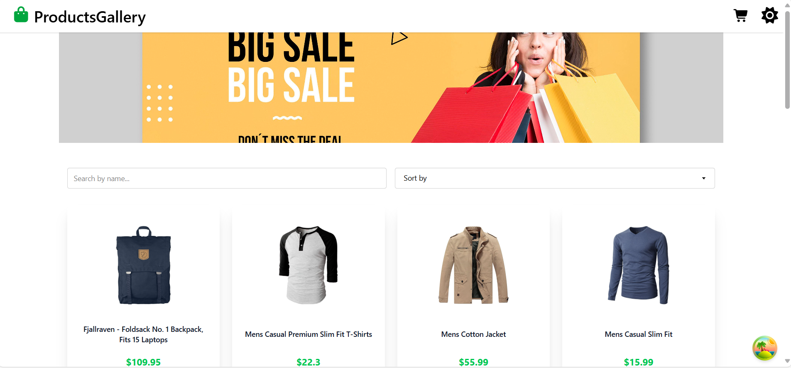

# products Gallery

Project Title:
🛍️ ProductsGallery - Product Gallery

Description:
ProductsGallery is an interactive web application designed for displaying products. It allows users to browse a wide range of products, view their details, and add them to a shopping cart. The goal of this project is to provide a seamless shopping experience and an appealing user interface, complete with full support for Dark Mode and robust search and sorting features to easily find products.

The application uses a mock API to fetch product data, making it an ideal showcase for frontend development skills and interaction with external data sources.

## Screenshots

*Description: The application's home page displaying products with search and sorting functionality.*

*Description: A specific product details page, showing price, description, and rating.*

*Description: The shopping cart page displaying added products, total price, and options for quantity adjustment and removal.*

## Tech Stack

* **Frontend:**
    * **React.js:** A fundamental JavaScript library for building user interfaces.
    * **React Router DOM:** For managing routes and navigation between application pages.
    * **Tailwind CSS:** A utility-first CSS framework for rapidly building responsive designs.
    * **DaisyUI:** A React component library built on Tailwind CSS to accelerate UI development.
    * **Axios:** For fetching data from the API.
    * **@tanstack/react-query:** For efficient data state management, fetching, and caching.

* **State Management:**
    * **React Context API:** Used for managing global states such as the shopping cart status and application theme (light/dark mode).

* **API:**
    * **Fake Store API:** (https://fakestoreapi.com/) This is the mock API used to retrieve product data.

* **Development Tools:**
    * **Vite:** A fast build tool to set up and run React projects quickly.
    * **Git & GitHub:** For version control and hosting the project online.
